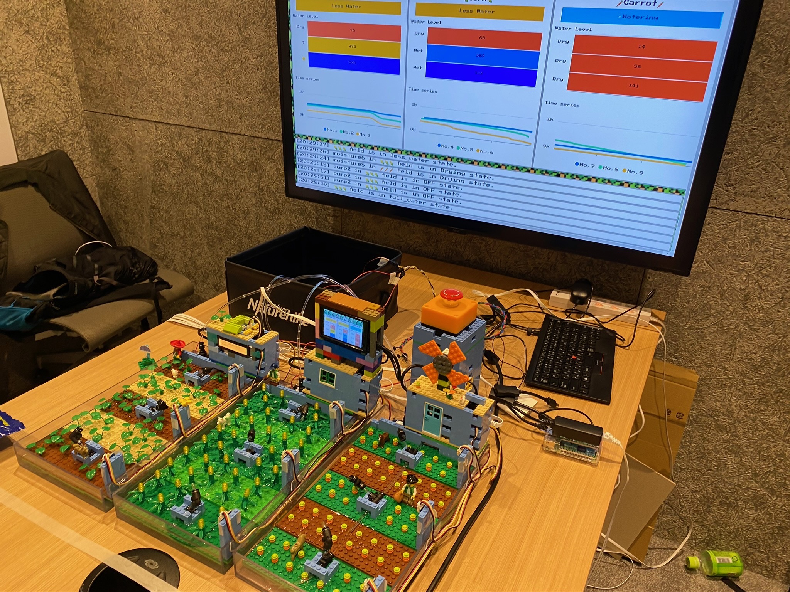

# Runbook

## Cloud
1. Create AWS IoT Events models
    1. Create AWS IoT Events models using model files which are in [iot-events](./iot-events)
1. Create [add_datetime Lambda function](./device/greengrass/add_datetime)
1. Create Greengrass Group
    1. Add add_datetime Lambda function to this group
1. Create dashboard
    1. See [dashboard/README.md](./dashboard/README.md) and setup dashboard

## Software
1. Setup Raspberry Pis
    1. Install Raspbian OS to SD card
    1. Setup Raspberry Pis for pumps and sensors
        1. Install [AWS Device SDK for Python](https://github.com/aws/aws-iot-device-sdk-python)
        1. Clone device code form this repo
        1. Setup Raspberry Pi for pumps
            1. Run [pump/run_pumps.sh](./pump/run_pumps.sh)
        1. Setup Raspberry Pi for sensors
            1. Run [sensor/moisture/moisture.py](./sensor/moisture/moisture.py)
    1. Setup Raspberry Pi for Greengrass
        1. Download and install AWS IoT Greengrass Core software
        1. Download and install credentials to Raspberry Pi
        1. Start Greengrass Core process
        1. Deploy Greengrass Group

## Hardware
1. Building LEGO blocks
1. Put moisture sensors to each field and connect to GrovePi board
1. Setup pumps
    1. Connect pumps to mechanical relay
    1. Connect mechanical relay to Raspberry Pi
    1. Connect hose to the pumps and put hose into each field

